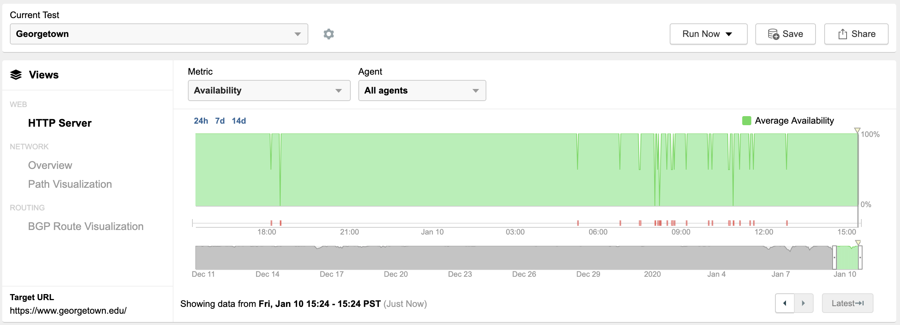
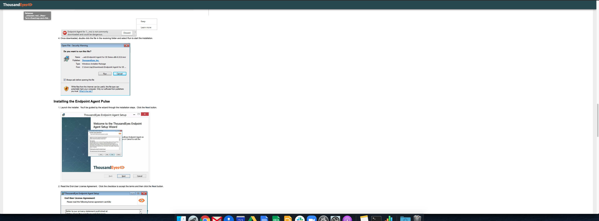

# Reporting on data collected by Endpoint Agent

ThousandEyes platform contains a reporting engine which provides both on-demand reports and scheduling of automatically generated reports. Data from tests can be organized into highly customized layouts, presented numerically or in tables or graphs, and sent via email to users. The Reports page \(Reports &gt; Reports\) allows you to create, modify and delete reports, and create and schedule snapshots of existing reports. You can report on the following Endpoint metrics collected by the Endpoint Agent

## Web metrics:

Page Success percentage  
Response Time

## Network metrics:

Loss  
Latency  
Jitter  
Connection Failures

## Network Topology:

Gateway Loss  
Gateway Latency  
Proxy Loss  
Proxy Latency  
VPN Loss  
VPN Latency  
Signal Quality  
Transmission Rate

When configuring Reports, search under the Metric dropdown for “**endpoint**” to view all Endpoint Agent metrics. To configure a report on data collected by Endpoint Agent, please refer our ["Working with Reports"](https://success.thousandeyes.com/ViewArticle?articleIdParam=kA0E0000000CmnTKAS) KB article.

